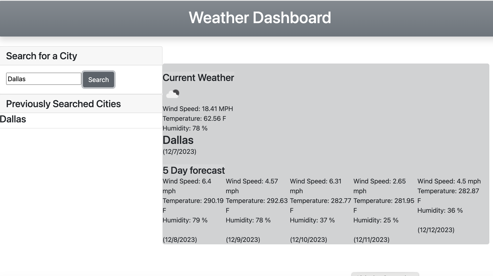

# Weather Dashboard

## Live URL can be found here:

https://yuliyatsoy.github.io/weather-dashboard/

## About this application:

It is a weather dashboard with form inputs. Using 5 Day Open Weather Map API a user is able to retrieve current weather conditions in a city along with 5 day forecast.
A user is able to type in a city name and click on the search button. After that he is presented with current weather in the city and a 5 day forecast is shown as well.

# The following image shows web application's appearance and functionality:

